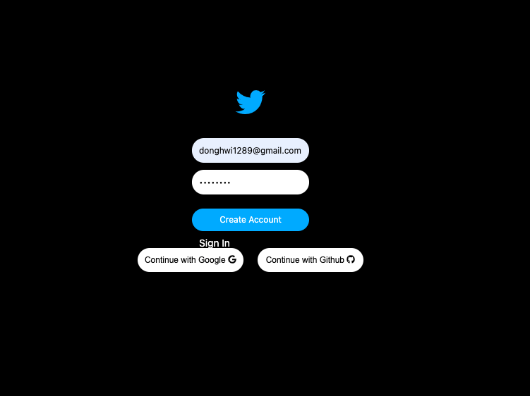

# React + firebase Project

> React + firebase를 사용해서 Back-end 고려없이(firebase를 이용) twitter Project 작업 

> [프로젝트 바로가기](https://wondonghwi.github.io/react_firebase/)

> < 기술스택 >
- react
- react-router-dom
- firebase - 9.0 Beta버전으로 작업

>< Firebase를 이용한 기능 작업 > 
- Firebase Email 로그인 연동 작업 
- Firebase Github 로그인 연동 작업
- Firebase Google 로그인 연동 작업
- Firebase 데이터 베이스 이용
- Firebase를 이용해 버킷생성 후 이미지 올리고 받아오기 기능 작성

> 얻은점
- 작은 프로젝트 or 프론트  작업 시험해보고 싶은게 있을때 firebase를 이용하면 "서버 / 인프라" 쪽을 firebase를 이용해서 쉽게 구성할 수 있다는것을   
  검증했고 앞으로 토이프로젝트 or 작게 해보고싶은 사이드 프로젝트에서 프론트 코드만으로도 작게 서비스를 오픈할 수 있다는 자신감, 경험을 얻음

